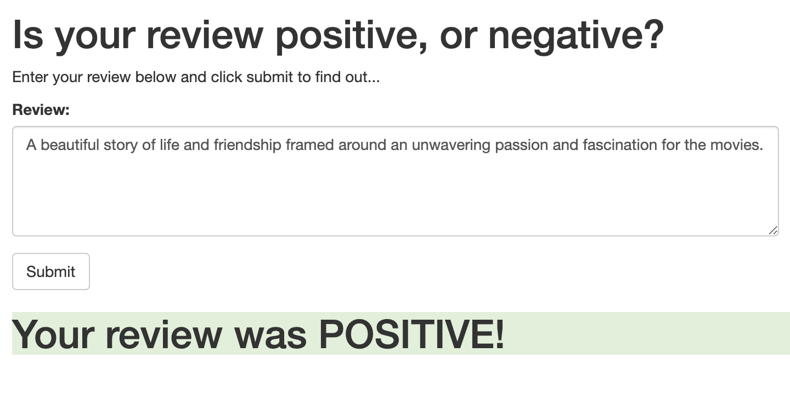
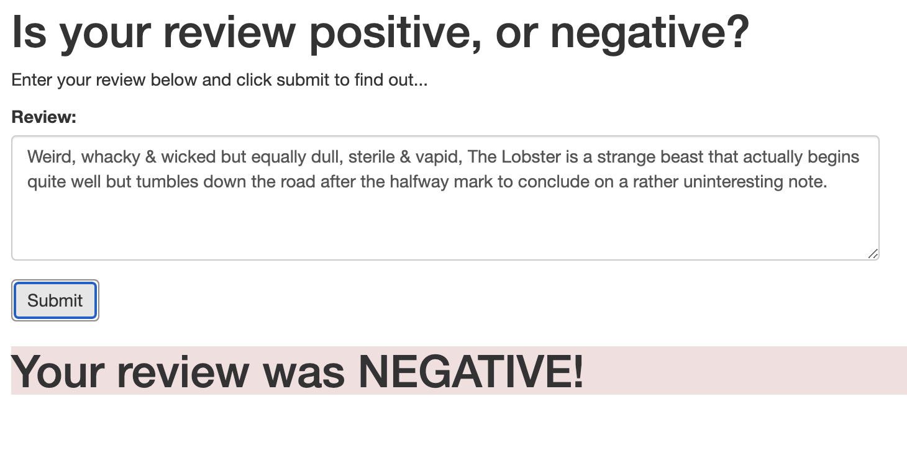

# SageMaker Deployment Project

## Udacity DLND

### Project Overview

In this project, we'll create a simple web app which interacts with a deployed recurrent neural network performing sentiment analysis on movie reviews.

### Result

------------------------------------------------

